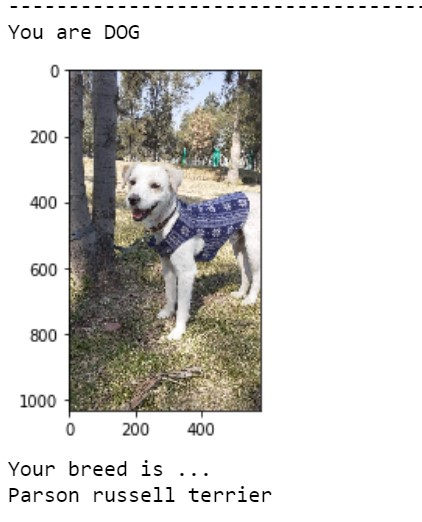

# Dog-Breed-Classifier

In this project, given an image of a dog, the algorithm will identify an estimate of the canine’s breed. If supplied an image of a human, the code will identify the resembling dog breed.

In this project we can explore the state-of-the-art CNN models for classification and localization.

# Project Instructions

1. Install [Jupyter Notebook](https://jupyter.org/install).

2. Clone the repository and navigate to the downloaded folder.

3. Download the [dog dataset](https://s3-us-west-1.amazonaws.com/udacity-aind/dog-project/dogImages.zip). Unzip the folder and place it in the repo, at location path/to/dog-project/dogImages. The dogImages/ folder should contain 133 folders, each corresponding to a different dog breed.

4. Download the [human dataset](http://vis-www.cs.umass.edu/lfw/lfw.tgz). Unzip the folder and place it in the repo, at location path/to/dog-project/lfw. If you are using a Windows machine, you are encouraged to use 7zip to extract the folder.

5. 
